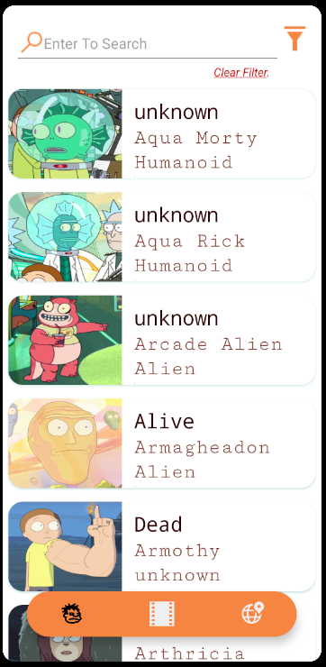
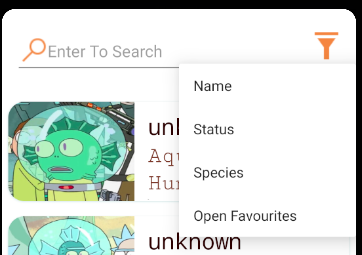
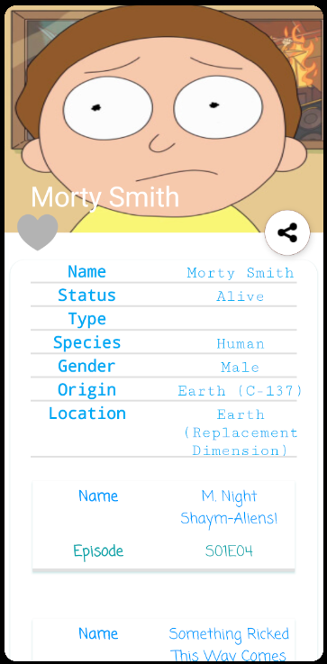
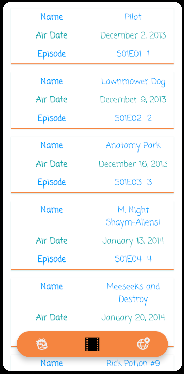
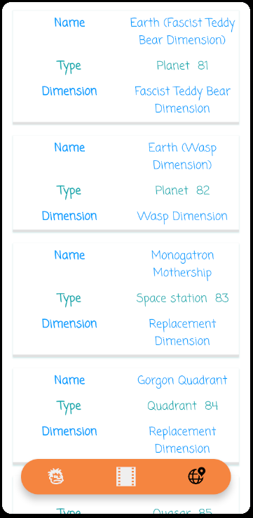
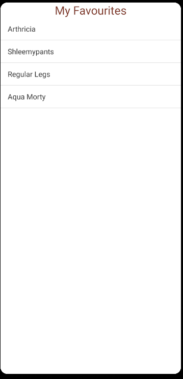
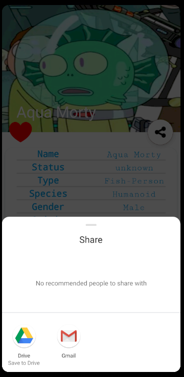

# Rick & Morty
## Présentation ## 
Projet mobile codé en Java, basé sur 3 fragments.  
1. Character (Liste de tous les personnages & Infos)  
2. Episodes 
3. Location  

Chaque fragments proposes des informations partager par l'API.
L'application permet d'afficher tous les personnages de la série Rick And Morty à partir d'une API Rest (https://rickandmortyapi.com/) à l'aide d'une RecyclerView. Elle suit l'architecture MVVM recommandée par Google.

## Prérequis ##
* Téléphone Android : Version Android 6.0 Marshmallow minimum.  

## Screen ##
### Splash screen : ###
 </img>
### Acceuil : ###
 </img>
### Naviguation : ###
 </img>
### Recherche : ###
 </img>
### Caractéristique : ###
 </img>
### Episodes : ###
 </img>
### Location : ###
 </img>
--------------------------------------------------------------------------------------------------------------------------------
## Bonus : ##
### Ajout de favoris ###
Ajouter un personnage en favoris avec le bouton coeur puis consultable à l'aide de la fonction filtre "Open Favourites"
 </img>
### Partager ###
Partager personnages via n'importe qu'elle application :  
 </img>
